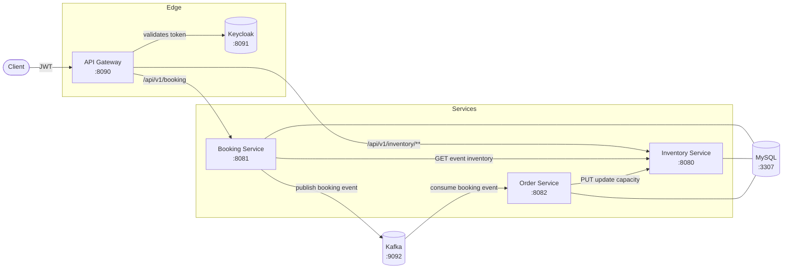

# Springboot Ticketing Microservices

A backend system for booking event tickets — think concerts, matches, shows. It handles the core problem any ticketing platform has to solve: don't sell the same seat twice, calculate prices correctly, and make sure every booking turns into a real, persisted order.

It's built as four separate Spring Boot services instead of one monolith: a gateway that handles auth and routing, a booking service that checks availability and creates bookings, an inventory service that's the single source of truth for how many seats are left, and an order service that records the final order after the fact via Kafka. It's a reasonable example of some common distributed-systems concerns in practice — service-to-service calls, async messaging, circuit breakers, and eventual consistency around shared inventory.

## Table of Contents

- [Architecture](#architecture)
- [Services](#services)
- [Tech Stack](#tech-stack)
- [Booking Flow](#booking-flow)
- [Prerequisites](#prerequisites)
- [Getting Started](#getting-started)
- [Configuration](#configuration)
- [API Reference](#api-reference)
- [Database Schema](#database-schema)
- [Project Structure](#project-structure)
- [Roadmap](#roadmap)

## Architecture



Each service owns its own logical tables in a shared MySQL instance (development setup) and can be split into per-service databases for production. The **Booking Service** and **Order Service** are decoupled through Kafka: a booking request is validated and published as an event, and the **Order Service** asynchronously persists the order and reconciles inventory.

## Services

| Service | Port | What it does |
|---|---|---|
| **API Gateway** | `8090` | Entry point for all client requests. Validates JWTs against Keycloak, routes to the right service, applies a circuit breaker around the booking route, and aggregates Swagger docs from both downstream services |
| **Inventory Service** | `8080` | Owns venue and event data — capacity, remaining seats, ticket price. All capacity checks and updates go through here |
| **Booking Service** | `8081` | Handles booking requests. Checks the customer exists, checks remaining inventory, calculates total price, and publishes a `BookingEvent` to Kafka |
| **Order Service** | `8082` | Consumes `BookingEvent`s from Kafka, persists the order, and calls back into Inventory Service to decrement the seat count |

## Tech Stack

- **Java 21** / **Spring Boot 4.x**
- **Spring Cloud Gateway (MVC)** — routing, `springdoc` aggregation
- **Spring Security (OAuth2 Resource Server)** + **Keycloak** — JWT auth at the gateway
- **Resilience4j** — circuit breaker on the booking route
- **Spring Data JPA** + **MySQL 8** — persistence
- **Flyway** — schema migrations (inventory-service)
- **Apache Kafka** (Confluent images) + **Kafka UI** + **Schema Registry** — event streaming between booking and order services
- **springdoc-openapi** — Swagger UI per service, aggregated at the gateway
- **Lombok**, **spring-dotenv** — boilerplate reduction / `.env` support
- **Docker Compose** — local infrastructure (MySQL, Kafka, Zookeeper, Keycloak)

## What Happens When Someone Books a Ticket

Walking through a single `POST /api/v1/booking` call:

1. The request hits the gateway, which validates the JWT against Keycloak and routes it to Booking Service. If Booking Service is down, the circuit breaker returns a `503` instead of letting the request hang.
2. Booking Service checks that the customer exists, calls Inventory Service to confirm there's enough capacity left, and calculates the total price.
3. Booking Service publishes a `BookingEvent` to Kafka and returns the priced booking to the client immediately — it doesn't wait for the order to be persisted.
4. Order Service, listening on that Kafka topic separately, persists the order record and calls Inventory Service to decrement the remaining capacity.

The notable part is steps 3 and 4: the client gets a confirmed booking response before the order actually exists in the database. That's an intentional eventual-consistency trade-off — it keeps the booking API fast and decoupled from order persistence, at the cost of a brief window where the order record doesn't exist yet.

## Prerequisites

- JDK 21+
- Maven (or use the included `mvnw` wrapper)
- Docker & Docker Compose
- MySQL client (optional, for inspecting data)

## Getting Started

### 1. Clone the repository

```bash
git clone https://github.com/Bareeraq/springboot-ticketing-microservices.git
cd springboot-ticketing-microservices
```

### 2. Start infrastructure (MySQL, Kafka, Keycloak)

The infrastructure compose file lives in `inventory-service/docker-compose.yml`. Create a `.env` file alongside it (or export the variables) with:

```env
DB_PASSWORD=your_mysql_root_password
DB_USERNAME=root
KEYCLOAK_DB_NAME=keycloak
KEYCLOAK_DB_USER=keycloak
KEYCLOAK_DB_PASSWORD=keycloak_pw
KEYCLOAK_DB_ROOT_PASSWORD=root_pw
KEYCLOAK_ADMIN=admin
KEYCLOAK_ADMIN_PASSWORD=admin
```

Then bring the stack up:

```bash
cd inventory-service
docker compose up -d
```

This starts:
- **MySQL** on `localhost:3307` (database `ticketing`)
- **Zookeeper** on `2181` and **Kafka broker** on `localhost:9092`
- **Kafka UI** on `http://localhost:8084`
- **Kafka Schema Registry** on `localhost:8083`
- **Keycloak** on `http://localhost:8091` (import your own realm export into `inventory-service/docker/keycloak/realms/` — this folder isn't included in the repo and must be added, or gateway security must be adjusted for local testing)

> Each service also needs `DB_USERNAME` and `DB_PASSWORD` available in its own environment (`spring-dotenv` reads a `.env` file per module, or you can export them as system env vars) since the Spring datasource config references `${DB_USERNAME}` / `${DB_PASSWORD}`.

### 3. Run each service

Inventory Service applies its own Flyway migrations on startup, so start it first:

```bash
cd inventory-service
./mvnw spring-boot:run
```

Then, in separate terminals:

```bash
cd booking-service && ./mvnw spring-boot:run   # :8081
cd orderservice     && ./mvnw spring-boot:run   # :8082
cd apigateway       && ./mvnw spring-boot:run   # :8090
```

### 4. Explore the API

- Aggregated Swagger UI (via gateway): `http://localhost:8090/swagger-ui.html`
- Inventory Service Swagger: `http://localhost:8080/swagger-ui.html`
- Booking Service Swagger: `http://localhost:8081/swagger-ui.html`
- Kafka UI: `http://localhost:8084`

## Configuration

Key `application.properties` values you'll typically override per environment:

| Property | Service | Purpose |
|---|---|---|
| `spring.datasource.url` | all | MySQL JDBC URL (defaults to `jdbc:mysql://localhost:3307/ticketing`) |
| `inventory.service.url` | booking, order | Base URL for calling Inventory Service |
| `spring.kafka.bootstrap-servers` | booking, order | Kafka broker address |
| `keycloak.auth.jwk-set-uri` | gateway | JWKS endpoint used to validate incoming JWTs |
| `security.excluded.urls` | gateway | Paths exempt from authentication (Swagger/docs) |

## API Reference

### Inventory Service (`/api/v1`)

| Method | Path | Description |
|---|---|---|
| `GET` | `/inventory/events` | List all events with remaining capacity and venue info |
| `GET` | `/inventory/event/{eventId}` | Get inventory (capacity, price) for a single event |
| `GET` | `/inventory/venue/{venueId}` | Get venue details and total capacity |
| `PUT` | `/inventory/event/{eventId}/capacity/{capacity}` | Decrement an event's remaining capacity by a ticket count |

### Booking Service (`/api/v1`)

| Method | Path | Description |
|---|---|---|
| `POST` | `/booking` | Create a booking — validates customer + inventory, publishes a `BookingEvent` to Kafka, returns the priced booking |

Example request body:

```json
{
  "userId": 1,
  "eventId": 1,
  "ticketCount": 2
}
```

### Order Service

Order Service has no public REST endpoints in this version — it operates purely as a Kafka consumer (`@KafkaListener` on the `booking` topic, consumer group `order-service`) that persists orders and updates inventory.

### API Gateway (`:8090`)

Routes all client-facing traffic and requires a valid Keycloak-issued JWT (except Swagger/doc paths):

- `POST /api/v1/booking` → Booking Service (with circuit breaker + fallback)
- `GET /api/v1/inventory/venue/{venueId}` → Inventory Service
- `GET /api/v1/inventory/event/{eventId}` → Inventory Service

## Database Schema

Managed via Flyway migrations in `inventory-service/src/main/resources/db/migration`:

| Table | Columns | Notes |
|---|---|---|
| `venue` | `id`, `name`, `address`, `total_capacity` | |
| `event` | `id`, `name`, `venue_id`, `total_capacity`, `left_capacity`, `ticket_price` | FK → `venue` |
| `customer` | `id`, `name`, `email`, `address` | |
| `order` | `id`, `total`, `quantity`, `placet_at`, `customer_id`, `event_id` | FK → `customer`, `event` |

All migrations run against a single shared `ticketing` database in this development setup, though each service's JPA layer only touches the entities it owns.

## Project Structure

```
springboot-ticketing-microservices/
├── apigateway/          # Spring Cloud Gateway, security, routing (:8090)
├── booking-service/     # Booking API + Kafka producer (:8081)
├── inventory-service/   # Venue/event inventory + Flyway migrations + docker-compose (:8080)
└── orderservice/        # Kafka consumer, order persistence (:8082)
```

Each module is a standalone Maven project with its own `pom.xml` and Maven wrapper (`mvnw`).

## Roadmap

- Per-service databases instead of a shared MySQL instance
- Contract/integration tests across the Kafka boundary
- Centralized configuration (Spring Cloud Config) and service discovery
- CI pipeline for build/test across all four modules

## License

Apache License 2.0
